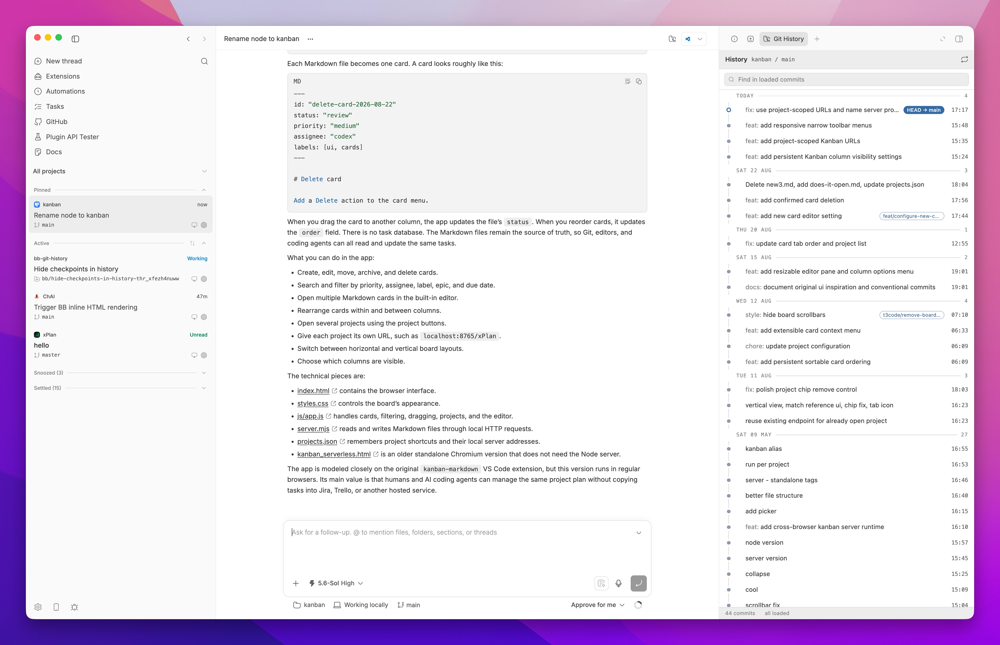

# Git History for bb

Git History adds a compact, read-only commit graph to a thread's right panel.
It reads repository refs, so the graph includes local branches,
remote-tracking branches, tags, stashes, and shared worktree history.



## Install

Install the latest compatible release from GitHub:

```sh
bb plugin install git:https://github.com/yusuf8834/bb-git-history.git@^0.3.0
```

For local development:

```sh
npm install --include=dev
npm run build
bb plugin install .
```

Open a project thread and select Git History from the right panel's Actions
list. Enable **Show thread header shortcut** in the plugin settings if you also
want a Git folder button beside the editor controls.

## What it shows

- Topologically ordered commits across repository refs
- Experimental branch and merge lanes using the compact history style
- Local, remote, tag, stash, and `HEAD` labels
- Commit author, date, full message, and first-parent changed files
- Per-file patches rendered by bb's native diff viewer
- Collapsible uncommitted-file list with working-tree diffs
- Infinite loading with virtualized rows

The experimental commit graph is enabled by default. Turn off **Experimental
commit graph** in the plugin settings to return to the single history rail.

The plugin does not run checkout, reset, merge, rebase, or other Git mutations.
Commits reachable only through reflogs are not part of the main graph.

## Development

```sh
npm test
npx tsc --noEmit
npm run build
```

The host entry runs Git on the thread environment's bb host. This keeps the
same behavior for local worktrees and repositories on connected machines.

## License

[MIT](LICENSE)
